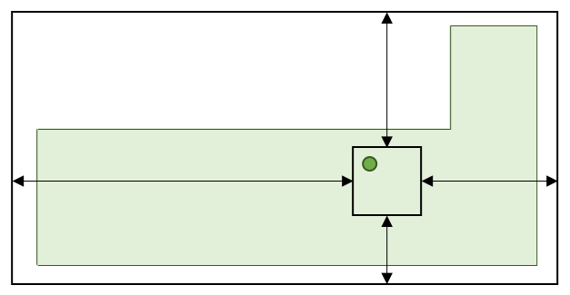

# UBID Visualization

The information content of a Unique Building Identifier (UBID) is two geometries:
* the geometry of the [Open Location Code (OLC)](https://github.com/google/open-location-code) grid cell that contains the centroid of the building footprint; and
* the geometry of the OLC-grid-aligned bounding box that is defined by the north, east, south and west extents.

**Figure 1.**
Depiction of an exemplar UBID without the source geometry for the building footprint.

A depiction of an exemplar UBID is given in Figure 1.
Visualizations of UBIDs are compositions of visualizations of the two geometries, along with visualizations of the north, east, south and west extents.
The geometries and extents are depicted as rectangles and double-ended arrows, respectively.

If the north, east, south and west extents are all equal to zero, then, by definition, the two geometries are identical, and only the OLC grid cell that contains the centroid of the building footprint is depicted, i.e., the OLC-grid-aligned bounding box and extents are not depicted.

**Figure 2.**
Depiction of an exemplar UBID with the source geometry for the building footprint.

A depiction of the same UBID with the source geometry for the building footprint is given in Figure 2.
The source geometry for the building footprint is depicted as a solid-filled polygon.

For certain use cases, it is beneficial for visualizations to depict the centroid of the source geometry for the building footprint.
In Figure 2, the centroid is depicted as a point.
